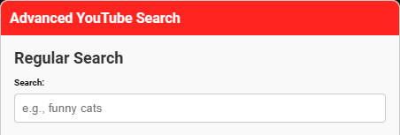
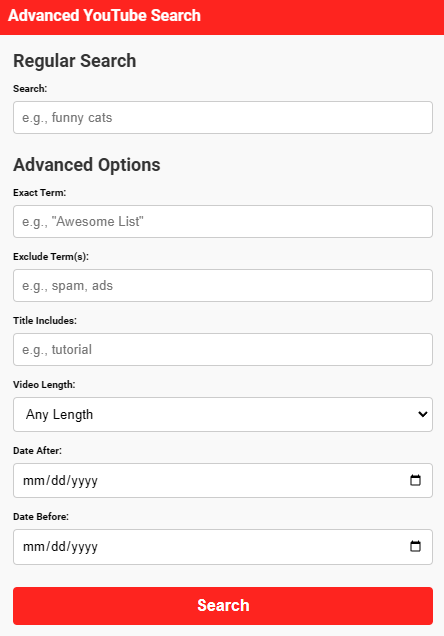
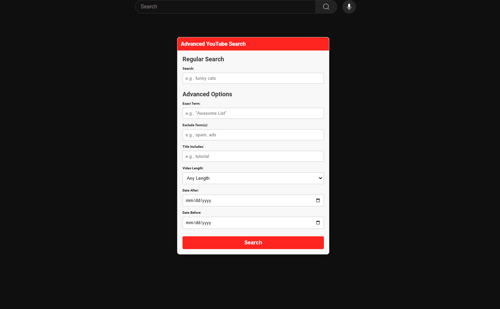

# Advanced YouTube Search


[](https://github.com/bitgineer/Advanced-YouTube-Search/stargazers)
[](https://github.com/bitgineer/Advanced-YouTube-Search/network/members)

Welcome to **Advanced YouTube Search** – a powerful Tampermonkey script designed to enhance your YouTube searching experience with advanced features. Whether you're looking for specific content, filtering out unwanted results, or refining your search based on various parameters, this script has got you covered!

## 📦 Table of Contents

- [Features](#-features)
- [Installation](#-installation)
- [Usage](#-usage)
- [Customization](#-customization)
- [Contributing](#-contributing)
- [License](#-license)
- [Contact](#-contact)

## 🚀 Features

**Advanced YouTube Search** offers a comprehensive set of features to refine and enhance your YouTube search capabilities:

### 🔍 Regular Search
- **Standard Search**: Perform regular YouTube searches without any additional parameters.

### 🛠️ Advanced Search Options
- **Exact Term**: Search for exact phrases by enclosing terms in quotes.
- **Exclude Term(s)**: Exclude specific terms from your search results.
- **Title Includes**: Ensure certain keywords are present in the video titles.
- **Video Length**: Filter results based on video duration:
  - Any Length
  - Under 4 minutes
  - 4-20 minutes
  - Over 20 minutes
- **Date After**: Include videos uploaded after a specific date.
- **Date Before**: Include videos uploaded before a specific date.

### 📍 Movable & Toggleable Popup
- **Movable Popup**: Drag the advanced search form to any position on the screen for personalized accessibility.
- **Toggleable Interface**: Easily show or hide the advanced search form with a single click.

### 🎨 User-Friendly Interface
- **Clean Design**: Seamlessly integrates with YouTube's interface without clutter.
- **Responsive Layout**: Optimized for various screen sizes and devices.

## 🛠️ Installation

To get started with **Advanced YouTube Search**, follow these simple steps:

### 1. Install Tampermonkey

**Tampermonkey** is a popular userscript manager available for various browsers.

- **Google Chrome**: [Tampermonkey Chrome Web Store](https://chrome.google.com/webstore/detail/tampermonkey/dhdgffkkebhmkfjojejmpbldmpobfkfo)
- **Mozilla Firefox**: [Tampermonkey Firefox Add-ons](https://addons.mozilla.org/firefox/addon/tampermonkey/)
- **Microsoft Edge**: [Tampermonkey Edge Add-ons](https://microsoftedge.microsoft.com/addons/detail/iikmkjmpaadaobahmlepeloendndfphd)
- **Safari**: [Tampermonkey Safari Downloads](https://apps.apple.com/app/tampermonkey/id6738342400)

### 2. Clone or Download the Repository

You can clone the repository using Git or download it as a ZIP file.

```bash
git clone https://github.com/bitgineer/Advanced-YouTube-Search.git
```

Alternatively, download the repository as a ZIP from the [GitHub page](https://github.com/bitgineer/Advanced-YouTube-Search).

### 3. Install the Userscript

1. Open the `Advanced YouTube Search` repository.
2. Locate the `AdvancedYouTubeSearch.user.js` file.
3. Click on the file to view its contents.
4. Click the **Raw** button to open the raw script.
5. Tampermonkey should automatically detect the script and prompt you to install it.
6. Confirm the installation by clicking **Install** in the Tampermonkey dialog.

> **Alternatively**, you can manually add the script:
> - Open Tampermonkey Dashboard.
> - Click on **Add a new script**.
> - Paste the script contents from `AdvancedYouTubeSearch.user.js`.
> - Save the script.

## 📝 Usage

Once installed, **Advanced YouTube Search** enhances your YouTube experience as follows:

### 1. Open YouTube

Navigate to [YouTube](https://www.youtube.com/) in your browser.

### 2. Access the Advanced Search Popup

- Click on the **🔍 Advanced Search** button fixed at the bottom-right corner of the page.
  
  

### 3. Perform a Regular Search

- **Regular Search Section**:
  - Enter your standard search query in the **Search** field.
  
  

### 4. Utilize Advanced Search Options

- **Advanced Options Section**:
  - **Exact Term**: Enter exact phrases (e.g., `"Awesome List"`).
  - **Exclude Term(s)**: Enter terms to exclude, separated by commas (e.g., `spam, ads`).
  - **Title Includes**: Enter keywords to include in video titles, separated by commas (e.g., `tutorial`).
  - **Video Length**: Select the desired video duration.
  - **Date After**: Choose a start date to include videos uploaded after this date.
  - **Date Before**: Choose an end date to include videos uploaded before this date.
  
  

### 5. Execute the Search

- Click the **Search** button to perform the search with the specified parameters.
- You will be redirected to the YouTube search results page with your filters applied.

### 6. Move the Popup (Optional)

- Click and hold the **Advanced YouTube Search** header.
- Drag the popup to your preferred location on the screen.
  
  

### 7. Close the Popup

- Click the **🔍 Advanced Search** button again.
- Alternatively, click anywhere outside the popup to close it.

## 🎨 Customization

You can customize **Advanced YouTube Search** to better fit your preferences:

### 1. Change Toggle Button Position

Modify the script to reposition the toggle button. For example, to move it to the top-right corner:

```javascript
toggleButton.style.top = '20px';
toggleButton.style.bottom = 'auto';
toggleButton.style.right = '20px';
```

### 2. Adjust Popup Size

Change the width of the popup:

```javascript
popupDiv.style.width = '450px'; // Adjust the width as desired
```

### 3. Modify Styles

Customize colors, fonts, or other styles by editing the corresponding CSS properties in the script.

### 4. Set Default Values

Pre-fill search fields by setting default `value` attributes when creating input elements in the script.

## 🤝 Contributing

Contributions are welcome! If you'd like to improve **Advanced YouTube Search**, please follow these steps:

1. **Fork the Repository**

   Click the **Fork** button at the top-right corner of the [repository page](https://github.com/bitgineer/Advanced-YouTube-Search).

2. **Clone Your Fork**

   ```bash
   git clone https://github.com/bitgineer/Advanced-YouTube-Search.git
   ```

3. **Create a Feature Branch**

   ```bash
   git checkout -b feature/YourFeatureName
   ```

4. **Commit Your Changes**

   ```bash
   git commit -m "Add your descriptive commit message"
   ```

5. **Push to Your Fork**

   ```bash
   git push origin feature/YourFeatureName
   ```

6. **Open a Pull Request**

   Navigate to the original repository and open a pull request with your changes.

### 📜 Guidelines

- Ensure your code follows the existing style and structure.
- Provide clear and concise commit messages.
- Include screenshots or descriptions for new features.
- Test your changes thoroughly before submitting.

## 📝 License

This project is licensed under the [MIT License](LICENSE).


## 📫 Contact

For any inquiries, suggestions, or feedback, feel free to reach out:

- **GitHub**: [@bitgineer](https://github.com/bitgineer)
- **Email**: [bitgineer@use.startmail.com](mailto:bitgineer@use.startmail.com)

---

Made with ❤️ by [bitgineer](https://github.com/bitgineer)
